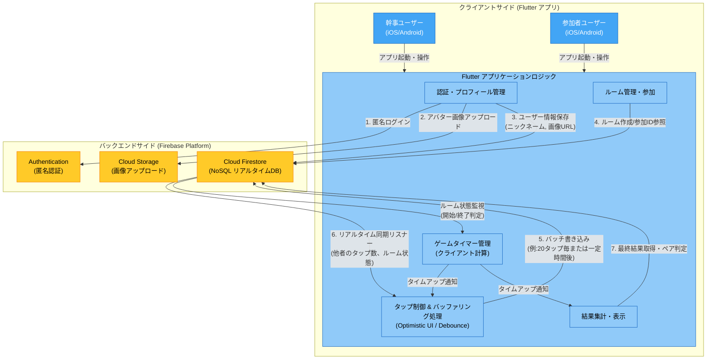

## 案件概要記載

[Tokyo Flutter Hackathon 2025](https://tokyo-flutter-hackathon.connpass.com/event/368402/)の「ほぼドコドア」チームのアプリ  
  
テーマ : 「みゃく」

## アプリ概要

アプリ名 **Myacle**  
読み : ミャクる  
  
「脈」+「miracle」 奇跡の出会い、「脈来る」 etc.
  
コンセプト   
「熱量（脈）」を「タップ数」で可視化する、合コン終盤専用のモバイルマッチングアプリ。
  
詳細な仕様などは[docs/00_overview](./00_overview/)を参照ください。  

## 開発手法

先にdocsに[アプリ概要書](./00_overview/01_app_overview.md)・[画面リスト](./00_overview/02_screen_list.md)・[Firestoreのスキーマ定義](./01_backend/01_firestore_schema.md)などを作成し、copilotに読み込ませて実装をした。
  
デザイン
Figma Makeなどを駆使して作成した。  


## ディレクトリ構成

```
├── lib/                      # アプリケーションのソースコード
│   ├── main.dart            # エントリーポイント
│   ├── config/              # アプリ全体の設定
│   │   ├── firebase/        # Firebase設定（dev/prod環境別）
│   │   ├── theme/           # テーマ設定（カラー、テキストスタイルなど）
│   │   └── app_sizes.dart   # サイズ定数
│   ├── enum/                # 列挙型定義
│   ├── feature/             # 機能別のモジュール
│   │   ├── user/            # ユーザー機能
│   │   ├── session/         # セッション（ルーム）機能
│   │   ├── join_room/       # ルーム参加機能
│   │   ├── create_room/     # ルーム作成機能
│   │   ├── room_lobby/      # ルームロビー機能
│   │   └── ...              # その他の機能
│   ├── routing/             # ルーティング設定（go_router）
│   ├── util/                # ユーティリティ関数・Mixin
│   └── widgets/             # 共通ウィジェット
├── docs/                     # ドキュメント
│   ├── README.md            # このファイル
│   ├── 00_overview/         # アプリ概要・画面リスト
│   ├── 01_backend/          # バックエンド仕様（Firestoreスキーマなど）
│   └── 02_frontend/         # 画面別の仕様書
├── android/                  # Android固有の設定
│   └── app/src/
│       ├── dev/             # 開発環境用設定
│       └── prod/            # 本番環境用設定
├── ios/                      # iOS固有の設定
│   └── config/
│       ├── dev/             # 開発環境用設定
│       └── prod/            # 本番環境用設定
├── assets/                   # 静的ファイル
│   ├── images/              # 画像ファイル
│   └── fonts/               # フォントファイル
├── test/                     # テストコード
├── pubspec.yaml             # パッケージ依存関係
└── analysis_options.yaml    # Linter設定
```

## 技術選定や構成に関する理由

- firebase
    - リアルタイム通信の実装が容易
    - Flutterとの親和性が高く、ある程度実装経験がある。
- 匿名認証
    - 個人情報などの登録はなしで、アカウント登録を極力簡略化し、誰もがすぐに利用できるようにするため。
- なぜモバイルアプリにしたか
    - 「投票」時のタップ操作をゲームをやっているような体験にしたく、Webよりもモバイルの方が効果的ではないかと思ったため。
    -  触覚フィードバックなどを実装することができ、より「思いの強さ（脈）」の熱量を伝えることができると思ったため。
- Flame
    - 思いの強さを、物理演算などを駆使して、視覚的（アイコンが大きくなる）にゲーム感覚で伝えるため。

## 環境構築

fvm と VSCode の利用を想定している。  
VSCode 用の設定は追加済みである。

**VSCode の設定**

VSCode でKotlin/Gradle Kotlin DSLファイルを読み込むため
VSCode の拡張機能で以下をインストール：

- Kotlin
- Gradle for Java

**Flutter SDK**

- バージョン管理ツール : [FVM](https://fvm.app/)
  - FVM のインストール・設定については、[こちらの記事](https://zenn.dev/riscait/articles/flutter-version-management)が参考になります。
  - FVM の 3 系を利用しています。[こちらの記事](https://zenn.dev/altiveinc/articles/flutter-version-management-3)を参考ください。
  - ※ 私は`Homebrew`でインストールしています。
- 使用しているバージョンは [.fvmrc](.fvmrc) に記載されています。
- FVM のインストール後、以下の流れで環境構築を実施。
  - プロジェクトのルートディレクトリで、`fvm flutter --version`を実行すると、ローカル環境に該当のバージョンがなければインストールされる。
  - VSCode の場合
    - VSCode を再起動する
    - main.dart などの dart ファイルを開き、エディタの右下の「Dart」部分をクリックして、該当のバージョンの Flutter が読み込まれていれば OK

### 環境分け

環境は公式ドキュメントを参考に`dev`（開発）と`prod`（本番）で分けています。

- [Set up Flutter flavors for Android](https://docs.flutter.dev/deployment/flavors)
- [Set up Flutter flavors for iOS and macOS](https://docs.flutter.dev/deployment/flavors-ios)

アプリアイコンは[flutter_launcher_icons](https://pub.dev/packages/flutter_launcher_icons)を使用し環境毎のファイルを用意しています。  
更新する場合は`assets/images/launcher`の画像を差し替えて下記コマンドを実行ください。

```
$ dart run flutter_launcher_icons
```

### Firebase 設定

Firebase は環境ごと（`dev`/`prod`）に分けて設定されています。  
アプリID毎に環境分けをしていますが、実質的には同じFirebaseプロジェクト（`flutter-hackathon-2025`）を参照しています。

- **設定ファイル**: `lib/config/firebase/{dev|prod}/firebase_options.dart`
- **Android**: `android/app/src/{dev|prod}/google-services.json`
- **iOS**: `ios/config/{dev|prod}/GoogleService-Info.plist`

`lib/main.dart` の `initializeFirebaseApp()` で Flavor に応じて適切な設定を読み込みます。

## 実行・ビルド方法

開発環境の実行コマンド

```console
$ fvm flutter run --debug --flavor dev --dart-define=FLAVOR=dev
```

本番環境の実行コマンド

```console
$ fvm flutter run --debug --flavor prod --dart-define=FLAVOR=prod
```

ビルドコマンド

```console
# Android
$ fvm flutter build appbundle --release --flavor prod --dart-define=FLAVOR=prod
# iOS
$ fvm flutter build ipa --flavor prod --dart-define=FLAVOR=prod
```

## 構成図・処理の流れ

